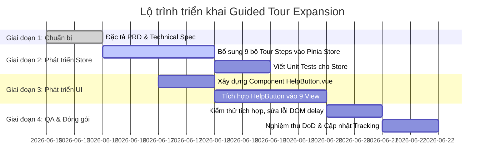

# 🏛️ Phân hệ Mở rộng Hướng dẫn tương tác (Guided Tour Expansion - Phase 2)

## 📌 Tổng quan Phân hệ
Phân hệ này mở rộng hệ thống Hướng dẫn tương tác (Guided Tour) sẵn có cho toàn bộ 9 view học tập tương tác cốt lõi của VisualizationDSA. Đảm bảo trải nghiệm onboarding mượt mà cho học viên mới, giảm thiểu tải lượng nhận thức khi tiếp cận giao diện mô phỏng thuật toán và kỹ nghệ phần mềm phức tạp, và cung cấp nút Trợ giúp `❓` dùng chung ở mỗi trang để xem lại hướng dẫn bất cứ lúc nào.

---

## 📂 Danh sách Tài liệu Thiết kế
*   **[Tài liệu Yêu cầu Sản phẩm (PRD)](./PRD.md):** Định hình nghiệp vụ, trải nghiệm người dùng, các trường hợp biên và Definition of Done (DoD).
*   **[Đặc tả Kỹ thuật (TECHNICAL_SPEC)](./TECHNICAL_SPEC.md):** Cấu trúc dữ liệu Tour Steps cho 9 View, mã nguồn component `HelpButton.vue` dùng chung, cơ chế tích hợp và test cases.

---

## 🗺️ Lộ trình Triển khai (Roadmap)

---

## 🏆 Definition of Done (DoD)
1.  **Pinia Store:** Đã tích hợp đầy đủ 9 bộ bước Tour Steps mới trong `PAGE_TOURS` và chạy thử nghiệm thành công.
2.  **UI/UX:** Nút Help `❓` xuất hiện ổn định ở góc dưới bên phải màn hình tại tất cả 9 View học tập chính. Click vào nút này lập tức khởi động lại Tour tương ứng.
3.  **Resilience:** Spotlight tự động co giãn chính xác theo bounding box của selector, tự ẩn nếu selector không tồn tại trên DOM, không làm đơ hay crash UI.
4.  **Testing:** Tất cả unit tests trong file `useGuidedTourStore.spec.ts` đều pass 100%.
